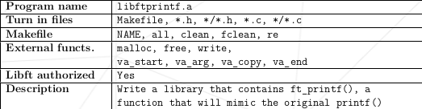

# Ft_Printf
## 22.02.22 - 30.04.22

## Description

In this project, the task is to recode the printf() function as ft_printf(). The ft_printf() function will handle various conversions such as %c, %s, %p, %d, %i, %u, %x, %X, and %%.

## Features

